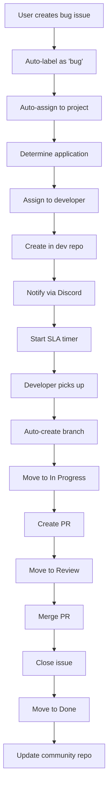
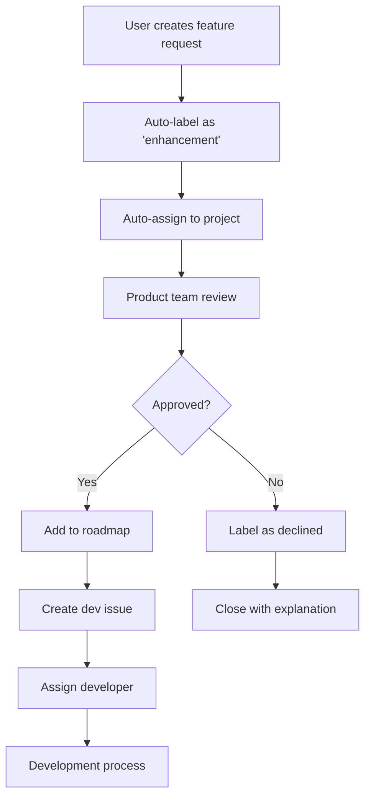

# 🚀 Panduan Setup Integrasi GitHub Project

## 🎯 Overview

Dokumen ini menjelaskan cara mengintegrasikan sistem bug report, feature request, dan notifikasi tim development dengan GitHub Project secara otomatis.

## 📋 Fitur Integrasi

### ✅ Yang Sudah Diimplementasikan:

1. **🤖 Auto-Assignment ke GitHub Project**
   - Setiap issue baru otomatis masuk ke project board
   - Auto-labeling berdasarkan template issue
   - Assignment developer berdasarkan aplikasi

2. **📬 Notifikasi Real-time**
   - Discord webhook untuk bug reports
   - Email notification untuk critical issues
   - Daily standup reports

3. **🔄 Cross-Repository Sync**
   - Issue dari community repo otomatis dibuat di development repo
   - Status sync balik ke community
   - Weekly community updates

4. **⏱️ SLA Monitoring**
   - Auto-tracking response time
   - SLA violation alerts
   - Progress monitoring

5. **🌿 Auto-Branch Creation**
   - Otomatis buat branch untuk approved bugs
   - Standardized naming convention
   - Link branch ke issue

## 🛠️ Setup Requirements

### 1. GitHub Secrets yang Diperlukan

```bash
# Repository Secrets (Settings > Secrets and variables > Actions)
DISCORD_WEBHOOK=https://discord.com/api/webhooks/xxx
EMAIL_USERNAME=github-bot@luckyjayagroup.com
EMAIL_PASSWORD=your-app-password
PROJECT_TOKEN=ghp_xxx (Personal Access Token dengan project permissions)
MAIN_REPO_TOKEN=ghp_xxx (Token untuk akses ke main repository)
COMMUNITY_REPO_TOKEN=ghp_xxx (Token untuk akses ke community repository)
```

### 2. GitHub Project Setup

#### Buat GitHub Project Baru:
1. Go to https://github.com/orgs/zahrasiska/projects
2. Click "New Project"
3. Pilih "Board" template
4. Nama: "LuckyJaya Development Board"

#### Setup Columns:
```
📋 Backlog       -> Issues baru masuk di sini
🔄 In Progress   -> Issues yang sedang dikerjakan
👀 Review        -> Menunggu code review
🧪 Testing       -> Sedang testing
✅ Done          -> Selesai
```

#### Setup Custom Fields:
```
Priority: High, Medium, Low
Complexity: High, Medium, Low
Estimate: 1, 2, 3, 5, 8, 13 (Story points)
Application: LTech Mobile, AsriJaya, API, Desktop, Database
Reporter Type: Community, Internal, Customer
```

### 3. Discord Server Setup

#### Buat Discord Server untuk Tim Development:
1. Server name: "LuckyJaya Development"
2. Channels:
   ```
   📢 announcements
   🐛 bug-reports (webhook dari GitHub)
   ✨ feature-requests (webhook dari GitHub)
   📊 daily-reports (automated reports)
   💬 general
   👥 standup
   ```

#### Setup Webhook:
1. Go to Discord channel settings
2. Integrations > Webhooks > New Webhook
3. Copy webhook URL untuk GitHub secrets

### 4. Email Notification Setup

#### Setup SMTP (contoh dengan Gmail):
```yaml
Server: smtp.gmail.com
Port: 587 (TLS) atau 465 (SSL)
Username: github-bot@luckyjayagroup.com
Password: App-specific password (bukan password Gmail biasa)
```

#### Setup App Password untuk Gmail:
1. Enable 2FA di Gmail account
2. Go to Account Settings > Security > App passwords
3. Generate app password untuk "GitHub Notifications"

## 🔧 Konfigurasi Advanced

### 1. Customisasi SLA Berdasarkan Severity

```yaml
# Dalam workflow file
SLA_CRITICAL: 4    # 4 jam untuk critical bugs
SLA_HIGH: 24       # 24 jam untuk high priority
SLA_MEDIUM: 72     # 72 jam untuk medium priority
SLA_LOW: 168       # 7 hari untuk low priority
SLA_FEATURE: 336   # 14 hari untuk feature requests
```

### 2. Routing Rules Berdasarkan Aplikasi

```yaml
# Auto-assignment berdasarkan keyword di issue body
LTech Mobile: knavinkids
AsriJaya Mobile: knavinkids
API/Backend: knavinkids
LuckyJaya Desktop: knavinkids
AsriJaya-Desc: knavinkids
ArisanManfaat: knavinkids
Database: knavinkids
```

### 3. Label Automation Rules

```yaml
Bug Labels:
  - bug (auto-applied for [BUG] issues)
  - critical (manual or keyword-based)
  - high, medium, low (based on priority field)
  - ltechmobile, asrijaya, api, desktop (based on application)

Feature Labels:
  - enhancement (auto-applied for [FEATURE] issues)
  - approved (manual by product manager)
  - declined (manual with reason)

Process Labels:
  - needs-triage (auto-applied for new issues)
  - in-progress (when developer starts working)
  - needs-review (when PR is created)
  - testing (when moved to testing column)
  - resolved (when issue is closed)
```

## 📊 GitHub Project Integration

### 1. Project v2 API Integration

```javascript
// Example untuk update project fields
const projectId = 'PVT_kwHOAAA'; // Project ID
const itemId = 'PVTI_lAHOAAA';   // Item ID

// Update priority field
await github.graphql(`
  mutation {
    updateProjectV2ItemFieldValue(
      input: {
        projectId: "${projectId}"
        itemId: "${itemId}"
        fieldId: "priority_field_id"
        value: {
          singleSelectOptionId: "high_option_id"
        }
      }
    ) {
      projectV2Item {
        id
      }
    }
  }
`);
```

### 2. Auto-Move Cards Berdasarkan Events

```yaml
# Workflow triggers untuk move cards
on:
  issues:
    types: [labeled]
  pull_request:
    types: [opened, closed]

# Rules:
# Label "in-progress" -> Move to "In Progress" column
# PR opened -> Move to "Review" column  
# Label "testing" -> Move to "Testing" column
# Issue closed -> Move to "Done" column
```

## 📈 Monitoring & Analytics

### 1. Daily Reports yang Dihasilkan:

```markdown
📊 Daily Development Report
- New Issues: X
- Resolved Issues: Y
- SLA Violations: Z
- Team Workload Distribution
- Priority Issues List
- Pending Reviews
```

### 2. Weekly Management Reports:

```markdown
📈 Weekly Summary
- Community Engagement Metrics
- Development Velocity
- Bug Resolution Rate
- Feature Delivery Status
- Team Performance Analytics
```

### 3. Real-time Notifications:

```
🐛 Bug Report Notifications (Discord)
✨ Feature Request Notifications (Discord)
🚨 Critical Issue Alerts (Email + Discord)
⏰ SLA Violation Warnings (Email + Discord)
📊 Daily Standup Reports (Discord)
```

## 🔄 Workflow Examples

### 1. Bug Report Flow:



### 2. Feature Request Flow:



## 🚨 Emergency Procedures

### 1. Critical Bug Response:

```yaml
Triggers:
  - Label contains "critical"
  - Keywords: "production down", "data loss", "security"
  
Actions:
  - Immediate email to all developers
  - Discord @everyone notification
  - Escalate to management
  - Create hotfix branch
  - SLA: 4 hours response time
```

### 2. SLA Violation Response:

```yaml
Warning (80% of SLA):
  - Notification to assigned developer
  - CC team lead
  
Violation (100% of SLA):
  - Escalate to team lead
  - Auto-comment on issue
  - Add to daily report
  
Critical Violation (200% of SLA):
  - Escalate to management
  - Emergency team meeting
```

## 📞 Troubleshooting

### Common Issues:

1. **Webhook tidak bekerja**
   - Check Discord webhook URL
   - Verify repository secrets
   - Check workflow permissions

2. **Auto-assignment gagal**
   - Verify PROJECT_TOKEN permissions
   - Check project URL format
   - Ensure project exists dan accessible

3. **Cross-repo sync error**
   - Check MAIN_REPO_TOKEN permissions
   - Verify repository names
   - Check if target repos exist

4. **Email notifications tidak terkirim**
   - Verify SMTP settings
   - Check email credentials
   - Ensure app password (bukan regular password)

### Logs dan Debugging:

```bash
# Check workflow runs
https://github.com/zahrasiska/luckyjayagroup-community/actions

# Check webhook deliveries
Settings > Webhooks > Recent Deliveries

# Test Discord webhook
curl -X POST $DISCORD_WEBHOOK \
  -H "Content-Type: application/json" \
  -d '{"content": "Test message"}'
```

## 🎯 Next Steps

### Immediate (Week 1):
1. ✅ Setup GitHub Project
2. ✅ Configure repository secrets
3. ✅ Test basic automation

### Short-term (Month 1):
1. 🔄 Fine-tune SLA timings
2. 📊 Setup advanced analytics
3. 🤖 Add more automation rules

### Long-term (Month 3):
1. 🔗 Integration dengan external tools (Jira, Slack)
2. 📈 Advanced reporting dan analytics
3. 🤖 AI-powered issue categorization

---

**🚀 Dengan setup ini, tim development akan mendapat notifikasi real-time dan tracking otomatis untuk semua community requests!**
