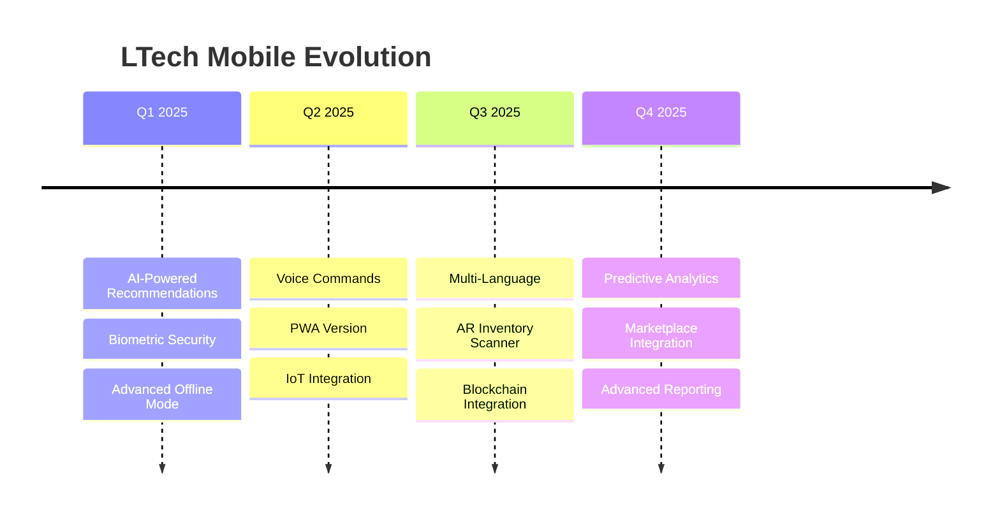
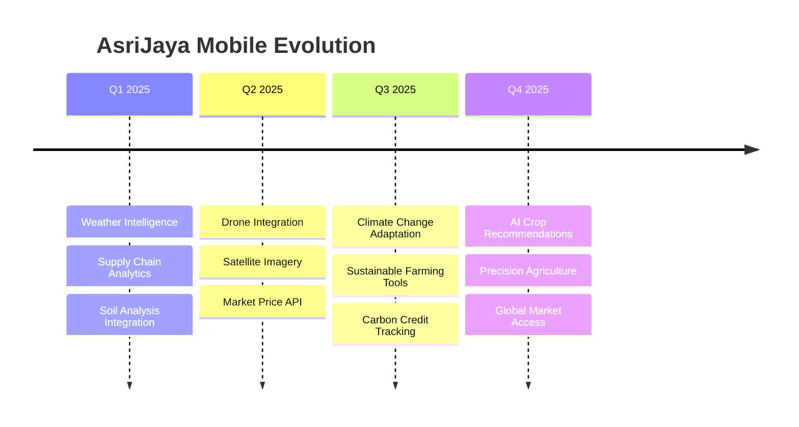

# Roadmap Pengembangan LuckyJaya Group

## 🗺️ Visi dan Strategi

### 🎯 Visi 2025-2027
Menjadi platform ERP terdepan di Indonesia yang mengintegrasikan teknologi AI, IoT, dan cloud computing untuk mendukung transformasi digital UMKM dan enterprise.

### 🚀 Tema Strategis
1. **Digital Transformation**: Modernisasi workflow tradisional
2. **AI Integration**: Intelligent automation dan predictive analytics
3. **Cloud-First**: Scalable dan accessible dari mana saja
4. **Mobile Excellence**: Mobile-first experience
5. **Ecosystem Integration**: Seamless integration dengan platform lain

---

## 📅 Timeline Roadmap

### Q1 2025 (Januari - Maret)

#### 📱 LTech Mobile v2.2.0
- ✨ **Advanced Offline Mode**
  - Full offline CRUD operations
  - Intelligent sync conflict resolution
  - Offline analytics dashboard
  
- 🤖 **AI Features**
  - Smart inventory recommendations
  - Automated reorder points
  - Sales pattern analysis

- 🔐 **Enhanced Security**
  - Biometric authentication
  - Multi-factor authentication
  - Device fingerprinting

#### 🌾 AsriJaya Mobile v1.9.0
- 🌡️ **Weather Integration Enhanced**
  - Hourly weather forecasting
  - Climate impact analysis
  - Automated planting recommendations

- 📊 **Supply Chain Analytics**
  - Real-time market price tracking
  - Demand forecasting per region
  - Supplier performance metrics

#### 🖥️ LuckyJaya Desktop v3.6.0
- ☁️ **Cloud Deployment Option**
  - AWS/Azure deployment support
  - Auto-scaling capabilities
  - Disaster recovery built-in

- 🔄 **Workflow Engine 2.0**
  - Visual workflow designer
  - Complex approval chains
  - SLA monitoring

### Q2 2025 (April - Juni)

#### 🌐 Platform Integration
- **PWA Launch**
  - Progressive Web App versions
  - Offline-first architecture
  - Native app-like experience

- **API Gateway**
  - Unified API management
  - Rate limiting dan security
  - Developer portal

#### 🤖 AI & Machine Learning
- **Predictive Analytics Suite**
  - Sales forecasting
  - Inventory optimization
  - Customer behavior analysis
  - Risk assessment

- **Natural Language Processing**
  - Voice commands
  - Chatbot integration
  - Automated data entry

### Q3 2025 (Juli - September)

#### 🌍 Multi-Language Support
- **Internationalization**
  - English interface
  - Mandarin support
  - Arabic support (untuk ekspor)

#### 📊 Business Intelligence 2.0
- **Advanced Dashboards**
  - Real-time KPI monitoring
  - Custom widget builder
  - Interactive data visualization

- **Self-Service Analytics**
  - Drag-and-drop report builder
  - Automated insights generation
  - Anomaly detection

### Q4 2025 (Oktober - Desember)

#### 🔗 Ecosystem Expansion
- **Marketplace Integration**
  - Tokopedia/Shopee connector
  - Amazon seller integration
  - WhatsApp Business API

- **Financial Services**
  - Invoice factoring integration
  - Digital payment gateway
  - Credit scoring

---

## 🎯 Platform-Specific Roadmaps

### 📱 Mobile Applications

#### LTech Mobile

#### AsriJaya Mobile

### 💻 Desktop Applications

#### LuckyJaya Desktop
- **Q1**: Cloud deployment, Workflow 2.0
- **Q2**: Advanced integrations, API management
- **Q3**: Multi-language, BI 2.0
- **Q4**: Ecosystem expansion, Financial services

#### ArisanManfaat
- **Q1**: Mobile companion app
- **Q2**: Digital payment integration
- **Q3**: Social features, community building
- **Q4**: Investment tracking, Financial planning

---

## 🔬 Innovation Labs

### 🧪 Experimental Features

#### Artificial Intelligence
- **Computer Vision**: Automated quality inspection
- **NLP Processing**: Document understanding
- **Recommendation Engines**: Personalized workflows
- **Anomaly Detection**: Fraud prevention

#### Emerging Technologies
- **Blockchain**: Supply chain transparency
- **IoT Integration**: Smart sensors
- **AR/VR**: Immersive training
- **Edge Computing**: Local processing

#### Sustainability
- **Carbon Footprint Tracking**: Environmental impact
- **Sustainable Supply Chain**: Green logistics
- **Renewable Energy Integration**: Solar tracking
- **Waste Management**: Circular economy

---

## 👥 Community-Driven Development

### 🗳️ Feature Voting System
- **Quarterly Votes**: Community prioritizes features
- **Impact Assessment**: Business value analysis
- **Resource Allocation**: Development planning
- **Feedback Loop**: Continuous improvement

### 🎯 Beta Testing Program
- **Early Access**: Test new features first
- **Feedback Collection**: Structured feedback process
- **Bug Bounty**: Reward significant findings
- **Feature Validation**: Real-world testing

### 📚 Open Source Components
- **Documentation Tools**: Community contributions
- **Plugin Architecture**: Third-party extensions
- **Template Library**: Shared configurations
- **Best Practices**: Community knowledge base

---

## 📊 Success Metrics

### 🎯 Key Performance Indicators

#### User Experience
- App Store Rating: Target 4.5+ stars
- User Retention: 90% monthly active users
- Support Tickets: <2% of active users/month
- Training Time: <4 hours for new users

#### Business Impact
- ROI for Customers: 300%+ within 12 months
- Implementation Time: <2 weeks average
- System Uptime: 99.9% availability
- Data Security: Zero major breaches

#### Technical Excellence
- Performance: <3 second load times
- Mobile Responsiveness: 100% features mobile-optimized
- API Reliability: 99.95% uptime
- Security Compliance: ISO 27001 certified

---

## 🚀 How to Influence the Roadmap

### 💡 Feature Requests
1. **Submit Ideas**: Use GitHub Issues dengan label "enhancement"
2. **Community Discussion**: Engage di GitHub Discussions
3. **Business Case**: Provide clear business justification
4. **Prototype**: Create mockups atau proof of concept

### 🗳️ Voting Process
1. **Quarterly Reviews**: Roadmap review sessions
2. **Priority Voting**: Community votes on features
3. **Impact Analysis**: Technical feasibility assessment
4. **Timeline Planning**: Integration into development cycles

### 🤝 Collaboration Opportunities
- **Beta Testing**: Early access programs
- **User Research**: Interview dan usability testing
- **Case Studies**: Success story sharing
- **Integration Partners**: Technology partnerships

---

## 📞 Roadmap Feedback

### 💬 Discussion Channels
- **GitHub Discussions**: [Community Forum](https://github.com/zahrasiska/luckyjayagroup-community/discussions)
- **Quarterly Surveys**: Detailed feedback collection
- **User Interviews**: One-on-one sessions
- **Advisory Board**: Strategic guidance

### 📧 Contact Information
- **Product Team**: product@luckyjayagroup.com
- **Strategic Planning**: strategy@luckyjayagroup.com
- **Partnership**: partnerships@luckyjayagroup.com

---

## 🔄 Roadmap Updates

Roadmap ini akan diupdate setiap kuartal berdasarkan:
- Market feedback dan trends
- Technical feasibility assessment
- Resource availability
- Community priorities
- Business strategic changes

**Last Updated**: Januari 2025  
**Next Review**: April 2025

---

**Catatan**: Roadmap ini adalah panduan strategis dan dapat berubah berdasarkan prioritas bisnis, feedback komunitas, dan kondisi pasar. Kami berkomitmen untuk transparansi dalam komunikasi perubahan roadmap. 🎯
